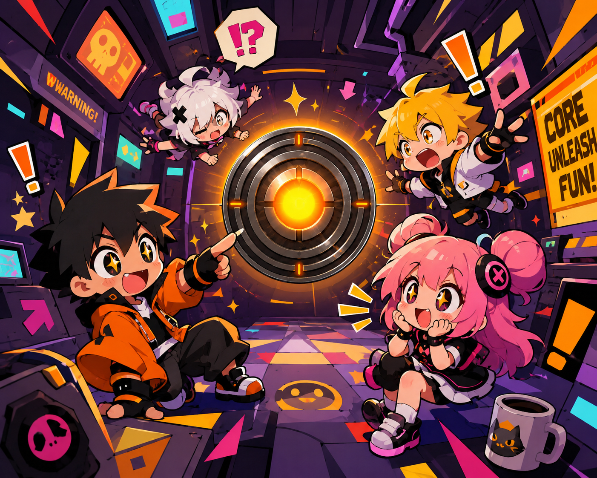

# 🌌 Hivera Portfolio

> Dark-themed cyberpunk portfolio — zero fluff, all signal.



## 🔗 Live

**[hivera.mooo.com](http://hivera.mooo.com)**

## 🛠️ Stack

- **HTML/CSS/JS** — vanilla, no frameworks, no bloat
- **Fonts:** Orbitron + Rajdhani + Inter
- **Theme:** Cyberpunk dark with orange/pink/purple accents
- **Deploy:** Caddy reverse proxy on Ubuntu VPS

## 📁 Structure

```
├── index.html    # Main portfolio (single file, ~40KB)
├── bg.png        # Background artwork
└── README.md     # You're here
```

## 🚀 Deploy

```bash
# Push to main triggers auto-deploy via GitHub Actions
git push origin main
```

Or manual:

```bash
ssh ubuntu@43.134.25.105 "cd /usr/share/caddy && git pull origin main"
```

## 🔧 Local Dev

```bash
# Serve locally
python3 -m http.server 8080
# Open http://localhost:8080
```

## ⚡ Features

- Animated particle background
- Smooth scroll navigation
- Responsive design
- Terminal-style UI elements
- Glitch effects & hover animations

---

> *"Built by Hivera. Deployed by Mythos."* 🔥
